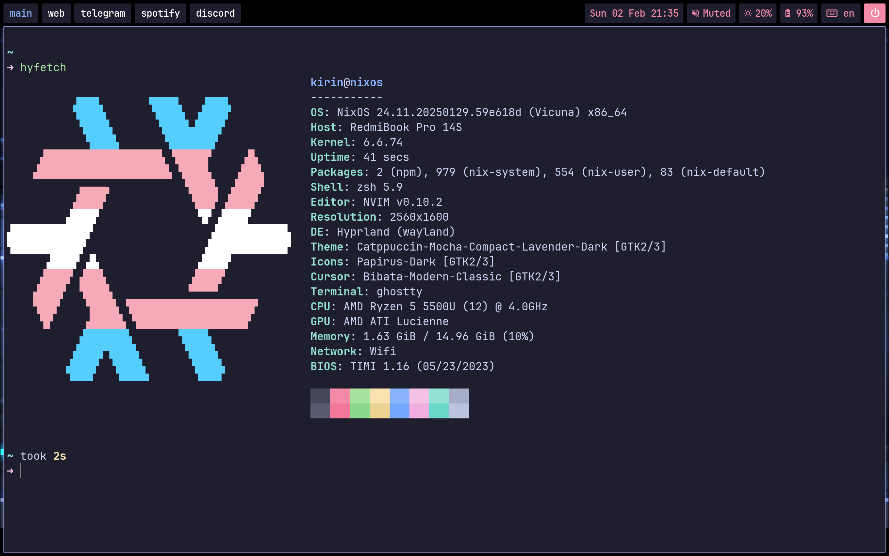
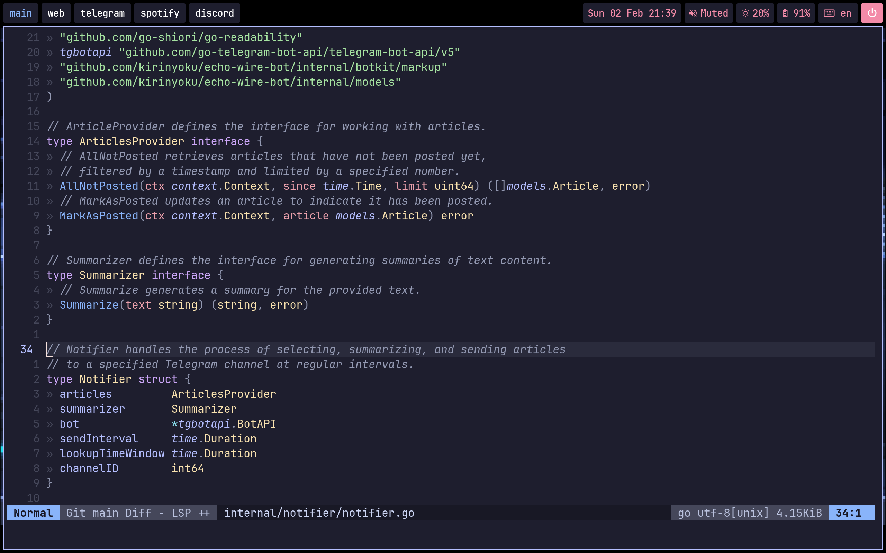

# My NixOS Config

- Display Manager: [SDDM](https://github.com/sddm/sddm) ([sddm-astronaut-theme](https://github.com/Keyitdev/sddm-astronaut-theme))
- Wayland Compositor: [Hyprland](https://hyprland.org)
- Wayland Bar: [Waybar](https://github.com/Alexays/Waybar)
- Menu: [Wofi](https://github.com/SimplyCEO/wofi)
- Terminal: [Ghostty](https://ghostty.org)
- Fetch: [hyfetch](https://github.com/hykilpikonna/hyfetch)
- Shell: [zsh](https://www.zsh.org)
- Shell Prompt: [Starship](https://starship.rs)
- Editor: [Neovim](https://neovim.io) (config based on [kickstart.nvim](https://github.com/nvim-lua/kickstart.nvim))
- [FireFox](https://www.mozilla.org/en-US/firefox/new) with [Catppuccin Theme](https://github.com/catppuccin/firefox)
- [Discord](https://discord.com) with [BetterDiscord](https://betterdiscord.app)
- [Spotify](https://spotify.com/) with [Spicefy](https://spicetify.app)
- Font: [JetBrainsMono Nerd Font](https://www.nerdfonts.com/font-downloads)

## Hyprland WayBar Ghostty Hyfetch

## Firefox

## Spotify

## Discord

## Neovim

